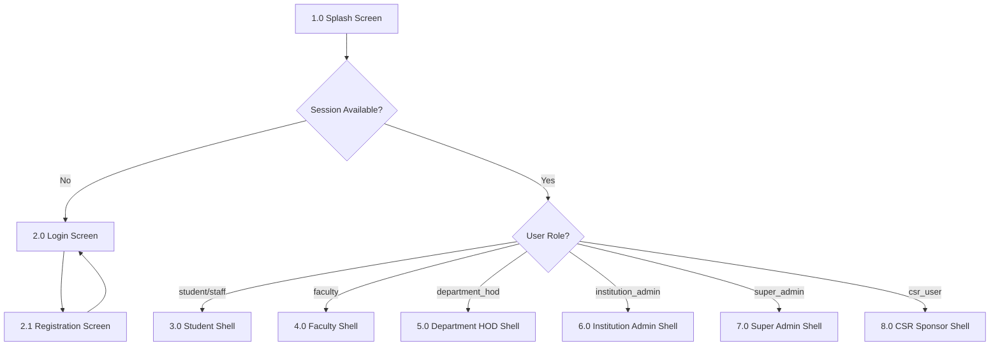

# VPP GREEN MAHARASHTRA — MOBILE APP FRONTEND UI MASTER PROMPT
## The Complete Screen Hierarchy, Layout Wireframe, & Page-by-Page Navigation Blueprint for Flutter

> **IMPORTANT:** Copy the entire content below (everything inside the triple-backtick code fence) and paste it into your AI coding assistant or hand it to your mobile developer team to implement the complete frontend UI, screen routes, and widget hierarchy.

---

```markdown
# ══════════════════════════════════════════════════════════════════════
#  🌳 VPP GREEN MAHARASHTRA — MOBILE FRONTEND UI SPECIFICATION
# ══════════════════════════════════════════════════════════════════════

## SECTION 0: UI RULES & DECORATION SPECIFICATION

You are a world-class Lead UI/UX Designer and Mobile Frontend Engineer. You will implement the complete screen hierarchy, page layouts, navigation flows, and components for the "VPP Green Maharashtra" mobile application in Flutter (using GoRouter & Riverpod).

### GLOBAL DESIGN RULES
1. **Typography:** Use `Poppins` for all Headings (Bold, Semibold) and `Inter` for Body text (Regular, Medium).
2. **Harmonious Palette (Forest Dark Mode & Glassmorphism):**
   - Background: Off-white/light gray `HSL(140, 10%, 96%)` or Dark Green `HSL(142, 64%, 8%)`.
   - Card Backgrounds: Pure white with 16dp rounded corners and soft drop shadows `rgba(0, 0, 0, 0.04)`.
   - Primary Interactive Elements: Vibrant Forest Green `HSL(142, 64%, 32%)`.
   - Active Highlights/Lime Details: `HSL(82, 85%, 55%)` for critical CTA buttons.
3. **Empty States:** Every list page must have an illustration, short description, and a primary action button if empty.
4. **Shimmer Loaders:** Implement custom shimmer effects (`shimmer` package) reflecting the actual card layouts during asynchronous state fetches.
5. **Interactive Feedback:** Include tap scale transitions (scale down to 0.96 on press) and haptic feedback triggers on all buttons.
6. **Main Branding Logo:** Render the company logo (`company_logo.png`) inside all layout headers, sidebars, and authentication cards.

---

## SECTION 1: GLOBAL PAGE ROUTING & NAVIGATION TREE

The application navigation is powered by `go_router`. It contains a nested shell route for the persistent Bottom Navigation Bar, which dynamically loads tabs and sub-pages based on the user's logged-in role.



---

## SECTION 2: PAGE-BY-PAGE WIREFRAME SPECIFICATIONS

---

### 1.0 Splash & Authentication Stack
Unauthenticated screens that load before entering the main shell route.

#### 1.0 Splash Screen (`/splash`)
- **Visuals:** Full-screen deep forest green gradient. The company logo animated in from the center.
- **Interactions:** Checks `Supabase.instance.client.auth.currentSession`. If present, queries user role in Zustand/Riverpod store, runs post-login routing. If absent, fades out and transitions to `/login` after 2.5 seconds.

#### 2.0 Login Screen (`/login`)
- **Visuals:** White curved card overlaying a green bottom sheet. Includes the company logo (`company_logo.png`) in the center card.
- **Form Inputs:**
  - Phone Number: 10-digit input field with "+91" prefix label.
  - Password: Obscured password field with eye icon suffix to toggle visibility.
- **Actions:**
  - "Login" Button (Forest green with active lime glow).
  - "Forgot Password?" Text Button.
  - "Create Student / Faculty Account" Text link.

#### 2.1 Registration Screen (`/register`)
- **Visuals:** Scrollable multi-step form with top progress tracker dots (Step 1: Contact, Step 2: Affiliation, Step 3: Security). Renders the company logo at the top left.
- **Form Inputs:**
  - Step 1: Full Name, Phone Number, Email Address.
  - Step 2: Role Switcher Toggle (Student / Staff vs. Faculty), Institution Dropdown (fetches dynamically from Supabase `institutions`), Department Selector, and Class Year (Students only).
  - Step 3: Create Password, Confirm Password.
- **Sub-pages (Modals):**
  - **Institution Selector Modal:** Full-height searchable list with filtering for rapid list selection.
  - **Department Selector Modal:** List populated based on selected institution's programs.

---

### 3.0 Student / Staff Portal
For planting trees, checking milestones, submitting updates, and downloading certificates.

```
3.0 Student Shell Router (Bottom Navigation Tabs)
├── Tab 1: Student Dashboard Page (/student/dashboard)
│   ├── Sub-page: Notifications (/notifications)
│   └── Sub-page: Green Pledge Canvas (/student/pledge)
├── Tab 2: Add Tree Wizard Page (/student/add-tree)
│   ├── Page Step 1: Camera Capture Stream
│   ├── Page Step 2: Species Picker & AI Review
│   ├── Page Step 3: Interactive Location Map Confirm
│   └── Page Step 4: Submission Success Confetti
├── Tab 3: My Trees Grid (/student/trees)
│   └── Sub-page: Tree Details (/student/tree/:id)
│       ├── Sub-page: Milestone Timeline
│       └── Sub-page: Monitoring Record Submission (/student/tree/:id/monitoring/:cycle)
│           └── Sub-page: AI Health Scanning Result
├── Tab 4: Global Leaderboard (/leaderboard)
└── Tab 5: Profile & Settings (/student/profile)
    ├── Sub-page: Edit User Profile (/student/profile/edit)
    ├── Sub-page: Earned Certificates List (/student/certificates)
    │   └── Sub-page: PDF Previewer Overlay
    └── Sub-page: Growth & CO2 Reports (/student/reports)
```

#### 3.1 Student Dashboard Page (`/student/dashboard`)
- **Layout:** Sticky header with company logo and bell icon (notifications). Row of glassmorphic stat widgets (Planted, Verified, Points, CO2 offset). Bottom card showing "Your Next Milestone Check-in" showing a progress bar towards the next cycle.

#### 3.2 Add Tree Wizard (`/student/add-tree`)
- **Layout:** Wizard with 4 distinct sub-steps.
- **Wizard Steps (Sub-pages):**
  - **Step 1: Camera Capture Stream:** Custom viewport utilizing camera controller. Shows overlay guides showing how to fit the sapling. Includes gallery select fallback.
  - **Step 2: Species Selection & AI Review:** Displays image overlayed with a pulse scanning animation. In parallel: calls FastAPI species detection and duplicate checker. If species confidence is >= 75%, highlights green, locks selection. If < 75%, raises warning, blocks next.
  - **Step 3: Location Confirmation:** Spawns a `GoogleMap` centered on EXIF or device coordinates. Allows draggable pin adjustment. Auto-populates readable address through reverse geocoding.
  - **Step 4: Submission Success:** Renders a clean success card with animated confetti overlays and navigates back to Dashboard.

---

### 4.0 Faculty Portal
For reviewing mentee students, approving tree registrations, and tracking team achievements.

```
4.0 Faculty Shell Router (Bottom Navigation Tabs)
├── Tab 1: Faculty Dashboard (/faculty/dashboard)
├── Tab 2: Verifications Queue (/faculty/verify)
│   ├── Sub-page: Verification Swiper Card Stack
│   └── Sub-page: Rejection Remarks Input Form
├── Tab 3: Mentee Students List (/faculty/students)
│   └── Sub-page: Mentee Student Detail File
├── Tab 4: Global Leaderboard (/leaderboard)
└── Tab 5: Profile & Settings (/faculty/profile)
```

#### 4.1 Faculty Dashboard (`/faculty/dashboard`)
- **Layout:** High-level overview. Stats showing total mentees count, pending review alerts, and institution average survival %. Shows a mini-feed of latest student submissions. Renders the company logo in sidebar/header.

---

### 5.0 Department HOD Portal
For managing department faculty, checking department-specific stats, and approving department plantations.

```
5.0 Department HOD Shell Router (Bottom Navigation Tabs)
├── Tab 1: HOD Dashboard (/hod/dashboard)
├── Tab 2: Department Verifications (/hod/verify)
│   └── Sub-page: HOD Verification Panel
├── Tab 3: Faculty Coordinators Management (/hod/faculty)
│   └── Sub-page: Faculty Details & Mentees List
├── Tab 4: Global Leaderboard (/leaderboard)
├── Tab 5: Department reports (/hod/reports)
└── Tab 6: Profile & Settings (/hod/profile)
```

#### 5.1 HOD Dashboard (`/hod/dashboard`)
- **Layout:** Scoped explicitly to the HOD's department (e.g., "Architecture Department"). Stats show: registered department students, trees planted, average survival %, and pending department approvals. Renders the company logo in header.

#### 5.2 Department Verifications Queue (`/hod/verify`)
- **Layout:** Lists all student submissions and faculty plantations belonging to their department. HOD has sole verification rights over faculty-planted trees.

---

### 6.0 Institution Admin Portal (Principal / Campus Admin)
For institution-wide oversight, campaigns configuration, and overall management.

```
6.0 Institution Admin Shell Router (Bottom Navigation Tabs)
├── Tab 1: Institution Dashboard (/institution/dashboard)
├── Tab 2: Active Campaigns Management (/institution/campaigns)
│   ├── Sub-page: Create Campaign Form
│   └── Sub-page: Campaign Performance Details
├── Tab 3: HOD & Faculty Directory (/institution/staff)
│   └── Sub-page: Add HOD / Faculty Profile
├── Tab 4: Global Leaderboard (/leaderboard)
├── Tab 5: College PDF Reports Exporter (/institution/reports)
└── Tab 6: Settings & Configs (/institution/settings)
```

---

### 7.0 Global Leaderboard Screen (`/leaderboard`)
This screen is accessible by **each and every profile** and contains a three-tab view:
1. **Personal Leaderboard (Free-for-All):** Ranks all students and faculty coordinators across the entire platform based on total Green Points. Shows name, points, department, and role badge (Faculty vs. Student).
2. **Department-Level Leaderboard:** Filtered rankings of individual students/faculty within a selected department. A dropdown toggles between departments.
3. **Department Teams Leaderboard:** Team-based rankings comparing department point aggregates.
- **Administration Actions:** If logged-in as `SUPER_ADMIN` or `INSTITUTION_ADMIN`, displays buttons to issue departmental bonuses (+50 points).
- **CSR view:** Read-only access to view all leaderboard tabs.

---

### 8.0 Super Admin Portal (VPP Head Office)
Global configuration panel for the entire system and cross-institution tracking.

```
8.0 Super Admin Shell Router (Bottom Navigation Tabs)
├── Tab 1: Super Admin Dashboard (/admin/dashboard)
├── Tab 2: Participating Institutions Panel (/admin/institutions)
│   ├── Sub-page: Add Institution Profile Form
│   └── Sub-page: Institution Stats Details
├── Tab 3: Fraud & Flagged Submissions Queue (/admin/plantations)
│   └── Sub-page: Fraud Comparison Side-by-Side Review
├── Tab 4: Global Leaderboard (/leaderboard)
├── Tab 5: AI Telemetry Control (/admin/ai)
│   └── Sub-page: AI Engine Swap & Accuracy Details
└── Tab 6: Settings & System Audit Logs (/admin/settings)
```

---

### 9.0 CSR Sponsor Portal
Read-only dashboards for corporate sponsorship monitoring and impact metrics.

```
9.0 CSR Sponsor Shell Router (Bottom Navigation Tabs)
├── Tab 1: CSR Dashboard (/csr/dashboard)
├── Tab 2: Sponsored Campaigns (/csr/projects)
│   └── Sub-page: Sponsorship Impact Metrics Details
├── Tab 3: Global Leaderboard (/leaderboard)
├── Tab 4: ESG Impact Reports (/csr/reports)
└── Tab 5: Profile & Settings (/csr/profile)
```

---

## SECTION 3: WIDGET TREE & SHARED FRONTEND STATES

### 3.1 Common Component Directory
Ensure reuse of these custom components:
- **`CustomButton`:** Features touch feedback, active state loaders, and tap scale transitions.
- **`CompanyLogo`:** Widget that displays the company logo from asset (`assets/images/company_logo.png`) or network, rendering centered with clean constraints.
- **`TreePhotoCard`:** Renders status pill overlays, title texts, and placeholder fallback boxes.
- **`AIScannerOverlay`:** Renders custom pulse scanner rings over pictures.

```
```

Generate clean, compilation-ready Flutter code following this layout structure.
```
